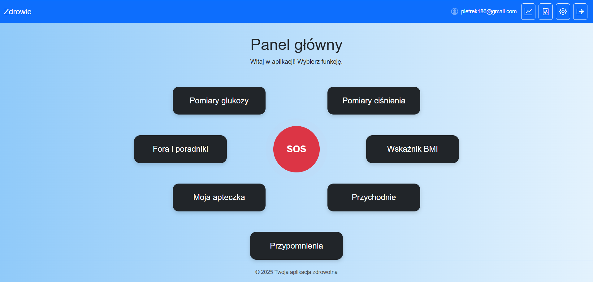
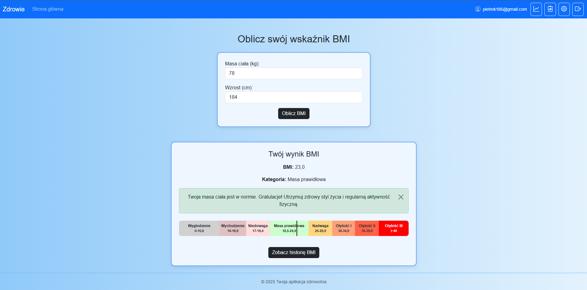
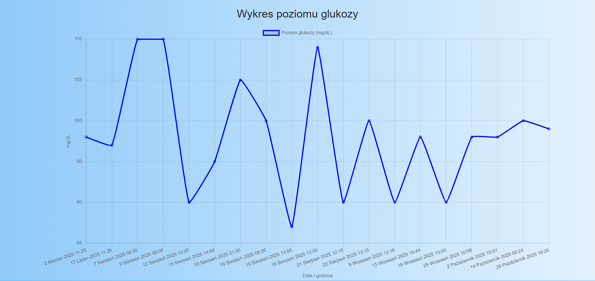
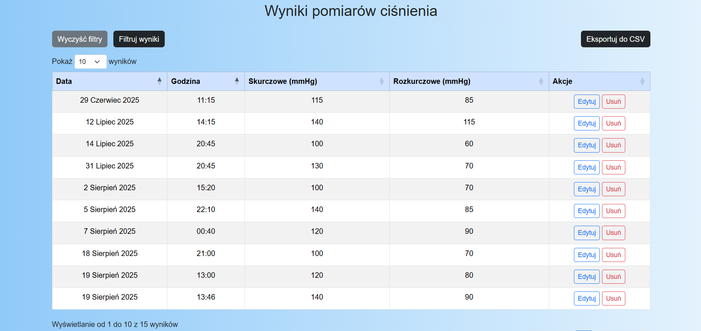
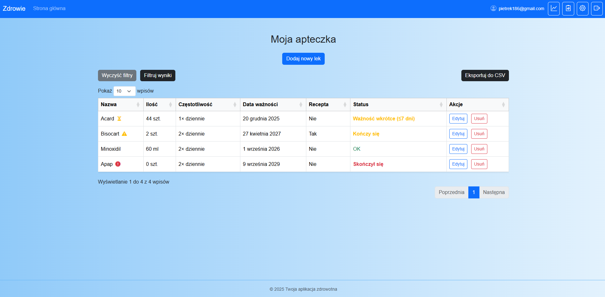
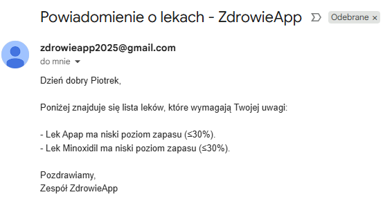
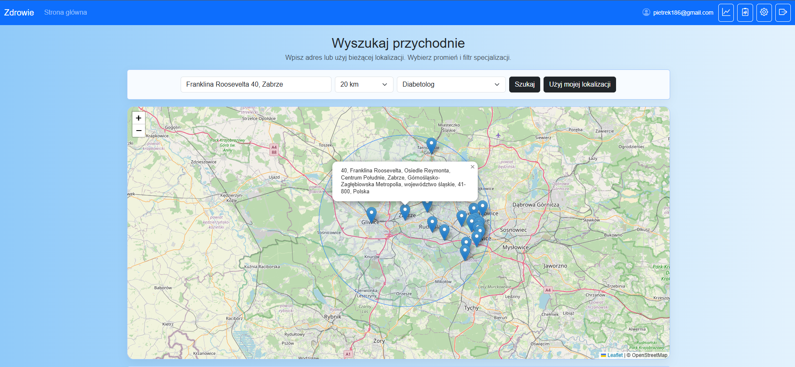

# Platform for Patients with Diabetes and Hypertension

**MSc thesis project – Biomedical Engineering (Medical Informatics)**

Web-based application designed to support patients with diabetes and hypertension,
with a focus on seniors. The platform enables remote health monitoring, therapy support,
and improved communication between patients and their caregivers.

---

## Project overview

The main goal of the project was to design and implement a web application that allows
patients to monitor their health parameters, manage their therapy, and access educational
resources in a structured, accessible, and user-friendly way.

The system was developed as part of my Master’s thesis and focuses on real-world medical
and usability requirements, especially for elderly users.

---

## Key features

### User management
- User registration and authentication
- Secure login system
- Ability to edit user profile data
- Caregiver account support with editable contact details
- Password change functionality

### Health measurements
- Blood glucose measurements with history
- Blood pressure measurements (systolic & diastolic)
- Validation of entered values
- Tabular presentation and graphical visualization of results

### BMI module
- BMI calculation based on height and weight
- BMI history tracking
- Interpretation of BMI values

### Virtual medicine cabinet
- Medication list management
- Dosage and intake frequency tracking
- Remaining medication level calculation
- Alerts for low medication supply
- Alerts for upcoming medication expiration dates

### Reminders and notifications
- Email reminders for medication intake
- Reminders for performing health measurements
- Custom reminders for user-defined activities
- Flexible reminder titles and scheduling

### Emergency support (SOS)
- SOS functionality for emergency situations
- Automatic email notification sent to the caregiver
- SMS notification sent to the caregiver

### Medical records
- Personal medical data storage
- Health history overview

### Map of medical facilities
- Interactive map of nearby medical clinics and healthcare facilities
- Support for finding medical assistance based on user location

### Education and community
- Educational section with guides and information for patients
- Community forums for people with diabetes and hypertension

### Data analysis and visualization
- Charts and tables for better interpretation of health data
- Filtering and sorting of measurement results
- Export of selected data to CSV files

---

## Tech stack

- Python
- Django
- SQL
- HTML & CSS
- JavaScript (including Chart.js for data visualization)

---

## Project status

This project was developed as part of my Master’s thesis.
The repository is published for **portfolio and educational purposes**.

---

## Security notes

Sensitive configuration data such as secret keys, email credentials,
and environment-specific settings are stored in environment variables
and are not included in this repository.

## Screenshots

### Dashboard


### BMI Calculator


### Glucose – trend chart


### Blood Pressure – results table


### Medication cabinet


### Email notification (low stock / expiring medication)


### Nearby clinics map


### SOS – SMS alert


## Installation & Local Setup

The project was developed as part of an MSc thesis and is intended primarily for demonstration and educational purposes.
Below are the steps required to run the application locally in a development environment.

### Requirements
- Python 3.10+
- pip
- virtualenv (recommended)
- SQLite (default) or PostgreSQL

### Local setup

1. Clone the repository:

```bash
git clone https://github.com/pietrek186/senior-health-platform.git
cd senior-health-platform
```

2. Create and activate a virtual environment:

```bash
python -m venv venv
source venv/bin/activate  # Linux / macOS
venv\Scripts\activate     # Windows
```

3. Install required dependencies:

```bash
pip install -r requirements.txt
```

4. Apply database migrations:

```bash
python manage.py migrate
```

6. Create a superuser (optional, for admin panel access):

```bash
python manage.py createsuperuser
```

7. Run the development server:

```bash
python manage.py runserver
```

8. Open the application in your browser:

```bash
http://127.0.0.1:8000/
```

## Medical Disclaimer

This application is intended for educational and demonstration purposes only and does not provide medical advice.

The information presented by the system (including measurements, charts, alerts, and recommendations) should not be considered a substitute for professional medical diagnosis, treatment, or advice.

Users should always consult qualified healthcare professionals regarding any medical conditions or decisions. The authors of this project assume no responsibility for improper use of the application or misinterpretation of the displayed data.

